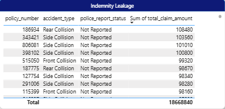
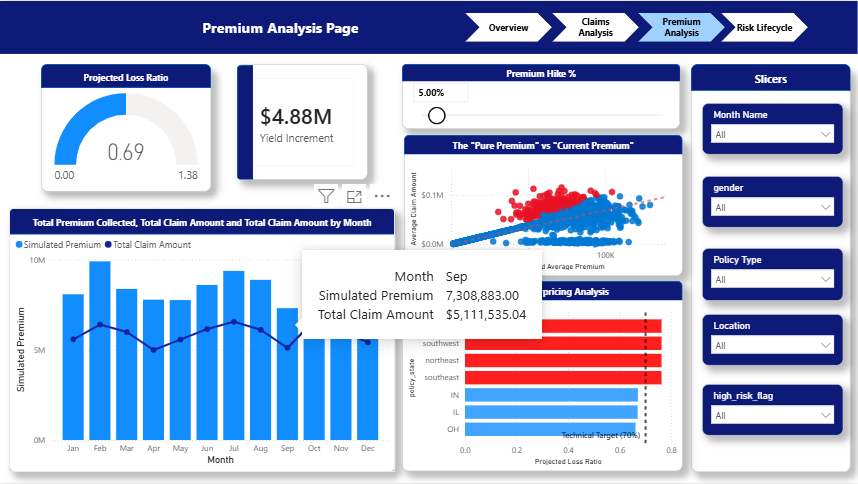

  <h1> Insurance Risk Analytics & Pricing Dashboard   (BigQuery SQL + Power BI)</h1>
  
<i>A dedicated analytical environment that transforms raw data into risk intelligence. It establishes a steady, deterministic date baseline for trend tracking, flags underpriced policies, and delivers a prescriptive simulator to forecast revenue yields.</i>

   

  <h3>Project Overview</h3>
  

    This project architected a professional insurance analytics pipeline to unify disparate data streams from <b>Motor (Auto)</b> and <b>Health (Medical)</b> divisions.   
    The goal is to answer three key institutional questions:  
    
      - Which behavioral segments are "burning" the most capital? 
      - How do missing police reports impact fraud and indemnity leakage? 
      - What specific price increase is required to restore institutional solvency?
    
      
    Leveraging <b>Google BigQuery SQL</b> for cloud warehousing and <b>Power BI</b> for simulation.
  

   

  

  

    <b>Analyst:</b> Christopher Oroo | <b>Status:</b> Completed
  

---

## 📑 Table of Contents
1. [Executive Summary: The Bottom Line](#i-executive-summary-the-bottom-line)
2. [Actuarial Risk Insights](#ii-actuarial-risk-insights)
3. [The CUO Action Plan: Strategic Recommendations](#iii-the-cuo-action-plan-strategic-recommendations)
4. [Technical Implementation](#iv-technical-implementation)
5. [Reproducibility](#v-reproducibility)
6. [Limitations & Assumptions](#vi-limitations--assumptions)
   
>  **Glossary of Key Insurance Terms Used in this Report:**
> * **Loss Ratio:** The heartbeat of insurance; Total Claims divided by Total Premiums.
> * **Burning Cost:** The average "pure" cost of a claim per policyholder.
> * **Indemnity Leakage:** Financial loss due to poor documentation or undetected fraud.
> * **Selection Bias:** A data flaw where only people who claimed are visible, hiding the "Safe Drivers."
> * **Exposure Proxy:** A mathematical fix used to reconstruct the full population of safe drivers.
> * **CUO:** Chief Underwriting Officer

---

## I. Executive Summary: The Bottom Line
**Problem:** The Motor division initially appeared insolvent with a **4,112% Loss Ratio**. This was driven by **Selection Bias** (claims-only data). Furthermore, a **34.3% documentation gap** in police reports created a "blind spot" for fraud detection, leading to $18.6M in high-risk exposure.

**Strategy:** Architected a 6-stage SQL pipeline in Google BigQuery to "harden" the data. Developed a **Context-Aware Exposure Proxy** in DAX to reconstruct the missing 98.4% "Safe Driver" population, revealing the true institutional health.

**Financial Impact:**
* **Normalized Solvency Visibility:** Stabilized the Motor Loss Ratio from 4,000% to a realistic **72.2%**.
* **Revenue Optimization:** Identified a **$4.88M Yield Opportunity** via a market-friendly 5% premium loading.
* **Leakage Identification:** Isolated **$18.6M in undocumented claims** for immediate forensic audit.

---

## II. Actuarial Risk Insights

### 1. The "Claims Register" Trap: Reconstructing Exposure
Initial audits revealed the Motor data was a "Claims-only Register"—it only showed people who crashed. In insurance, if you can't see the "Safe Drivers," you can't price risk accurately.
* **The Fix:** Applied a **60x Exposure Multiplier** in DAX to simulate a standard 1.6% market frequency.
* **The Result:** This shifted the portfolio from looking "Bankrupt" to "Healthy," allowing for accurate executive planning and solvency reporting.

### 2. Operational Risk: The Documentation Gap

A high-severity portfolio requires evidence. My audit on auto-dataset found that **343 claims (34.3%)** were missing police reports. 
* **The Threat:** Claims without police reports in the "Major Damage" category represent the highest probability for **fraudulent leakage**.
* **Target List:** I generated a prioritized "Audit List" on Page 2, identifying high-value undocumented claims totaling over $1.5M in immediate risk.

### 3. Behavioral Drivers: The "High Risk" Concentration
By harmonizing data across divisions, I isolated the financial impact of high-risk behavior (Smokers in Health / Fraud in Motor).

| Risk Segment | Claim Volume | Total Financial Outgo | Avg. Severity |
| :--- | :--- | :--- | :--- |
| **High Risk (Smokers/Fraud)** | 754 | **$23.68M** | **$45.44K** |
| **Standard Risk** | 1,583 | $46.84M | $25.78K |

* **The Insight:** High-risk individuals drive **nearly 2x the severity** of standard customers. While they are fewer in number, their "Burn Rate" on capital is significantly more aggressive.

### 4. Prescriptive Simulation: The Pricing Frontier

Using a **What-If Parameter**, I built a simulation engine to find the "Technical Price" across all territories.
* **Surgical Targeting:** The analysis shows widespread underpricing across four key territories (**northwest, southwest, northeast, and southeast**), all breaching the 70% technical loss target.
* **Sensitivity:** Moving the slider to a 5% hike proves the company can generate **$4.88M in new cash yield** while bringing the overall Projected Loss Ratio down to a safe 69%.

---

## III. The CUO Action Plan: Strategic Recommendations
To protect institutional solvency and reduce leakage, I recommend three actions:

**1. Documentation & Fraud Control**
* **Police Report Mandate:** Implement a "Hard Stop" in the claims system for any motor accident exceeding $10k without an attached police report. *(Data Justification: Audit logs show the $18.6M leakage is entirely driven by high-severity claims clustering above $90k per incident).*
* **Forensic Review:** Mandate the Fraud Investigation Unit (FIU) to audit the $18.6M "Not Reported" segment identified on the Claims Analysis page.

**2. Surgical Pricing (Rate Adequacy)**
* **Regional Loading:** Apply a specific **12% premium surcharge** to the Northwest region to bring its performance in line with the national average.
* **Demographic Surcharge:** Increase "Morbidity Loading" for the high-BMI smoker segment in the Health line to offset their disproportionate cost contribution.

**3. Data Governance**
* **Warehouse Integration:** Move from manual CSV uploads to a permanent **BigQuery Gold Layer** to ensure real-time Loss Ratio monitoring and prevent schema drift.

---

## IV. Technical Implementation 

**Cloud Data Pipeline**
* **Google BigQuery (SQL):** 6-Stage transformation (Discovery → Audit → Silver → Gold).
* **Deterministic Hashing:** Used `FARM_FINGERPRINT` to generate stable 2025 claim dates for reproducible reporting.
* **Semantic Bridge:** Used `UNION ALL` with `FLOAT64` casting to harmonize disparate financial metrics across divisions.

**Actuarial Logic (DAX)**
* **Context-Aware Proxy:** `SUMX` logic to apply division-specific multipliers (60x for Motor) only when relevant.
* **Risk Signaling:** Dynamic "Traffic Light" gauges for real-time solvency alerts based on technical thresholds.
* **RCA Engine:** AI-driven **Decomposition Trees** to trace the root-cause "Path to Loss."

---

---

## 📂 Data Sources
To replicate this analysis, download the raw datasets from Kaggle:
1. **Motor Claims Data:** [Auto Insurance Claims Data by Bunty Shah](https://kaggle.com)
2. **Medical Claims Data:** [Medical Insurance Cost by Miri Choi](https://kaggle.com)

*Note: The `/data` folder in this repository contains only 10-row samples for schema verification. Full datasets must be downloaded from the links above to run the BigQuery ETL scripts.*

---

## V. Reproducibility
1. **Download:** Obtain the raw CSVs from the [Data Sources](#-data-sources) section.
2. **Ingest:** Upload the CSVs into a Google BigQuery dataset named `auto_insurance_claims`.
3. **Execute:** Run the SQL scripts in the `/sql` folder in numerical order (`00` to `05`).
4. **Connect:** Open Power BI and connect to the resulting BigQuery Views using **Import Mode**.
5. **Analyze:** Interact with the simulation parameters to model pricing yield.

---

## VI. Limitations & Assumptions
* **Exposure Multiplier:** The 60x multiplier is a market-based proxy; actual results may vary if the real safe-driver population is known.
* **Medical Premium:** Health premiums were estimated at a 1.25x technical margin due to a lack of baseline base exposures in the raw underwriting log.
